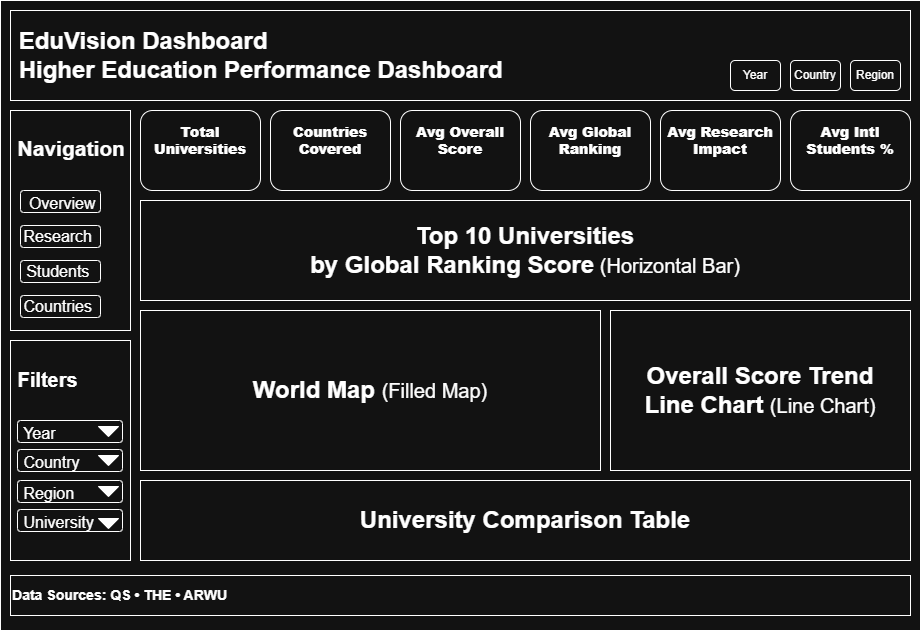
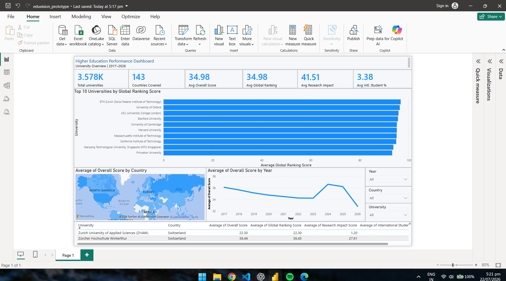

# 🎓 Higher Education Performance Dashboard


> Infosys Springboard EduVision_DV Internship Project

---

## 📈 Project Workflow

Dataset Collection
→ Data Cleaning
→ KPI Engineering
→ Dashboard Planning
→ Dashboard Development
→ Dashboard Integration
→ Testing
→ Documentation

---

## 👨‍💻 Intern

**Name:** GURU-SASANK

**Internship:** Infosys Springboard Virtual Internship 7.0

---

## 📖 Project Overview

This project aims to integrate, clean, analyze, and visualize global higher education ranking datasets from multiple sources (QS, THE, and Research datasets). The final outcome is an interactive Power BI dashboard that enables meaningful comparison of universities, countries, and academic performance across the years 2017–2026.

---

## 🚀 Current Progress

### ✅ Module 1 – Dataset Preparation

- Collected QS, THE and Research datasets
- Generated QS, THE and Research master datasets
- Merged datasets into a unified master dataset
- Standardized schema across ranking systems
- Recovered university and geographic information
- Generated `university_raw_data.csv`

### ✅ Module 2 – Data Cleaning & Preprocessing

- Performed missing value analysis
- Applied rule-based data recovery
- Applied statistical and iterative imputation
- Applied Random Forest–based imputation for selected missing values
- Recovered metadata across university records
- Achieved **99.82% dataset completeness**
- Generated `university_cleaned.csv`

### 📊 Module 2 Dataset Summary

| Metric | Value |
|---------|------:|
| Rows | 23,263 |
| Columns | 36 |
| Missing Values | 1,504 |
| Missing Percentage | 0.18% |
| Completeness | **99.82%** |

### ✅ Module 3 – KPI Engineering

#### KPIs Generated

- Global Ranking Score
- Research Impact Score
- Faculty-to-Student Ratio
- International Student Percentage
- Academic Reputation KPI
- Research Productivity Index

#### Outputs

- `generate_education_kpis.py`
- `university_final_dataset.csv`
- `university_final_dataset.xlsx`

### 📊 Final Dataset Summary

| Metric | Value |
|---------|------:|
| Rows | 23,263 |
| Columns | 41 |
| Missing Values | 1,504 |
| Missing Percentage | 0.18% |
| Completeness | **99.82%** |

#### ✅ Module 4 – Dashboard Planning & Prototyping

#### Storyboards Completed

- University Overview
- Research Analytics
- Student Analytics
- Country Comparison

#### Power BI Prototype Completed

- University Overview Dashboard

#### Features Implemented

- 6 KPI Cards
- Interactive Slicers
- Filled Map
- Top 10 University Ranking
- Overall Score Trend
- University Comparison Table

#### Deliverables

- dashboard_storyboard.pdf
- eduvision_prototype.pbix

## 🖼️ Storyboard Preview

### University Overview Storyboard




## 🖥️ Dashboard Preview

### University Overview Prototype



---

## 📂 Project Structure

```text
higher-education-dv/
│
├── datasets/
│   ├── raw/
│   │   ├── qs/
│   │   ├── the/
│   │   └── research/
│   │
│   └── final/
│       ├── intermediate/
│       │   ├── qs_master.csv
│       │   ├── the_master.csv
│       │   ├── research_master.csv
│       │   ├── education_master.csv
│       │   └── master_dataset.csv
│       │
│       ├── Module_1_Deliverables/
│       │   └── university_raw_data.csv
│       │
│       ├── Module_2_Deliverables/
│       │   └── university_cleaned.csv
│       │
│       └── Module_3_Deliverables/
│           ├── university_final_dataset.csv
│           └── university_final_dataset.xlsx
│
├── notebooks/
│   ├── Module_1/
│   │   └── module1_dataset_preparation.ipynb
│   │
│   └── Module_2/
│       └── education_data_quality_enhancement.ipynb
│
├── scripts/
│   ├── Module_1/
│   │   ├── master_dataset_creation.py
│   │   ├── merge_qs_the.py
│   │   └── qs_merge.py
│   │
│   └── Module_3/
│       └── generate_education_kpis.py
│
├── powerbi/
│   └── Module_4_Deliverables/
│       ├── storyboard/
│       │   ├── dashboard_storyboard.drawio
│       │   ├── dashboard_storyboard.pdf
│       │   ├── University_Overview.png
│       │   └── Research_Analytics.png
│       │
│       └── prototype/
│           ├── eduvision_prototype.pbix
│           └── dashboard_preview.png
│
└── README.md
```
---

## 🛠️ Tech Stack

- Python
- Pandas
- NumPy
- Scikit-learn
- Jupyter Notebook
- Power BI
- Git
- GitHub

---

## 🚀 Next Milestones

- Build Research Analytics Dashboard
- Build Student Analytics Dashboard
- Build Country Comparison Dashboard
- Dashboard Integration
- Testing & Validation
- Final Documentation

---

## 📌 Status

🟢 Modules 1–3 Completed Successfully

Current Progress:
- Dataset Integration ✅
- Dataset Preparation ✅
- Data Cleaning & Preprocessing ✅
- KPI Engineering ✅
- Dashboard Planning & Prototyping ✅
- Dashboard Development ⏳ (Research, Student & Country Dashboards)

---

## 📊 Progress

| Module                                      | Status          |
| ------------------------------------------- | -----------     |
| Module 1 – Dataset Preparation              | ✅ Completed    |
| Module 2 – Data Cleaning & Preprocessing    | ✅ Completed    |
| Module 3 – KPI Engineering                  | ✅ Completed    |
| Module 4 – Dashboard Planning & Prototyping | ✅ Completed    |
| Module 5 – Dashboard Development            | ⏳ Pending      |


---

## 📦 Deliverables

### Module 1

- `scripts/`
- `module1_dataset_preparation.ipynb`
- `university_raw_data.csv`

### Module 2

- `education_data_quality_enhancement.ipynb`
- `university_cleaned.csv`

### Module 3

- `generate_education_kpis.py`
- `university_final_dataset.csv`
- `university_final_dataset.xlsx`

### Module 4

- `dashboard_storyboard.pdf`
- `eduvision_prototype.pbix`

---

## 📌 Repository Updates

This repository is actively maintained as part of the Infosys Springboard EduVision_DV Internship. Upcoming updates include additional interactive dashboards, dashboard integration, testing, documentation, and final project delivery.