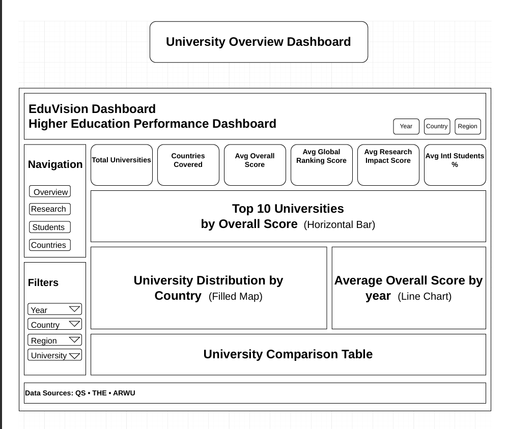
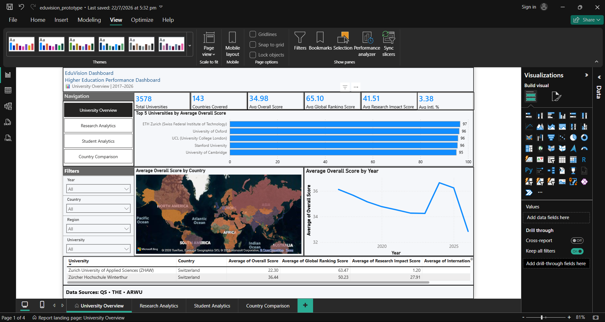

# 🎓 Higher Education Performance Dashboard


> Infosys Springboard EduVision_DV Internship Project

---

## 📈 Project Workflow

Dataset Collection
→ Data Cleaning
→ KPI Engineering
→ Dashboard Planning
→ Dashboard Development
→ Dashboard Integration
→ Testing
→ Documentation

---

## 👨‍💻 Intern

**Name:** GURU SASANK JINKA

**Internship:** Infosys Springboard Virtual Internship 7.0

---

## 📖 Project Overview

This project aims to integrate, clean, analyze, and visualize global higher education ranking datasets from multiple sources (QS, THE, and Research datasets). The final outcome is an interactive Power BI dashboard that enables meaningful comparison of universities, countries, and academic performance across the years 2017–2026.

---

## 🚀 Current Progress

### ✅ Module 1 – Dataset Preparation

- Collected QS, THE and Research datasets
- Generated QS, THE and Research master datasets
- Merged datasets into a unified master dataset
- Standardized schema across ranking systems
- Recovered university and geographic information
- Generated `university_raw_data.csv`

### ✅ Module 2 – Data Cleaning & Preprocessing

- Performed missing value analysis
- Applied rule-based data recovery
- Applied statistical and iterative imputation
- Applied Random Forest–based imputation for selected missing values
- Recovered metadata across university records
- Achieved **99.82% dataset completeness**
- Generated `university_cleaned.csv`

### 📊 Module 2 Dataset Summary

| Metric | Value |
|---------|------:|
| Rows | 23,263 |
| Columns | 36 |
| Missing Values | 1,504 |
| Missing Percentage | 0.18% |
| Completeness | **99.82%** |

### ✅ Module 3 – KPI Engineering

#### KPIs Generated

- Global Ranking Score
- Research Impact Score
- Faculty-to-Student Ratio
- International Student Percentage
- Academic Reputation KPI
- Research Productivity Index

#### Outputs

- `generate_education_kpis.py`
- `university_final_dataset.csv`
- `university_final_dataset.xlsx`

### 📊 Final Dataset Summary

| Metric | Value |
|---------|------:|
| Rows | 23,263 |
| Columns | 41 |
| Missing Values | 1,504 |
| Missing Percentage | 0.18% |
| Completeness | **99.82%** |

#### ✅ Module 4 – Dashboard Planning & Prototyping

#### Storyboards Completed

- University Overview
- Research Analytics
- Student Analytics
- Country Comparison

#### Power BI Prototype Completed

- University Overview Dashboard

#### Features Implemented

- 6 KPI Cards
- Interactive Slicers
- Filled Map
- Top 10 University Ranking
- Overall Score Trend
- University Comparison Table

#### Deliverables

- dashboard_storyboard.pdf
- eduvision_prototype.pbix

## 🖼️ Storyboard Preview

### University Overview Storyboard




## 🖥️ Dashboard Preview

### University Overview Prototype



## ✅ Module 5 – Dashboard Development

### Dashboards Developed

- University Overview Dashboard
- Research Analytics Dashboard
- Student Analytics Dashboard
- Country Comparison Dashboard

### Features Implemented

- Interactive Page Navigation
- Dynamic KPI Cards
- Cross-filtering & Drill-down
- Responsive Slicers
- Geographic Visualizations
- Executive Summary Dashboards

### Deliverables

- eduvision_dashboard_v1.pbix

### ✅ Module 6 – Dashboard Integration & Expansion

#### Dashboards Completed

- Student Analytics Dashboard
- Country Comparison Dashboard

#### Student Analytics

- Student population analysis
- Student-to-staff/faculty ratio analysis
- International student analysis
- Student diversity analysis
- Enrollment comparisons
- Student distribution analysis

#### Country Comparison

- Country ranking comparison
- Education performance benchmarking
- Regional education trends
- Top-performing country analysis

#### Dashboard Integration

- Global filters
- Navigation controls
- Dashboard linking
- Interactive filtering
- Cross-dashboard navigation

---

### ✅ Module 7 – Testing & Validation

#### Testing Completed

- KPI calculation validation
- Ranking calculation validation
- Dashboard interaction testing
- Filter and slicer validation
- Navigation testing
- Educational metric validation
- Visual and dashboard consistency checks

#### Deliverables

- QA Checklist
- Dashboard Testing Report

---

### ✅ Module 8 – Documentation & Project Delivery

#### Documentation Completed

- Project documentation
- KPI definitions
- Dashboard usage guide
- Education analytics methodology
- QA documentation
- Dashboard testing report

#### Project Delivery

- Final Power BI dashboard
- Final datasets
- KPI generation scripts
- Dashboard documentation
- QA and testing artifacts
- GitHub repository

---

## 📂 Project Structure

```text
higher-education-dv/
│
├── datasets/
│   ├── raw/
│   │   ├── qs/
│   │   ├── the/
│   │   └── research/
│   │
│   └── final/
│       ├── intermediate/
│       │   ├── qs_master.csv
│       │   ├── the_master.csv
│       │   ├── research_master.csv
│       │   ├── education_master.csv
│       │   └── master_dataset.csv
│       │
│       ├── Module_1_Deliverables/
│       │   └── university_raw_data.csv
│       │
│       ├── Module_2_Deliverables/
│       │   └── university_cleaned.csv
│       │
│       └── Module_3_Deliverables/
│           ├── university_final_dataset.csv
│           └── university_final_dataset.xlsx
│
├── notebooks/
│   ├── Module_1/
│   │   └── module1_dataset_preparation.ipynb
│   │
│   └── Module_2/
│       └── education_data_quality_enhancement.ipynb
│
├── scripts/
│   ├── Module_1/
│   │   ├── master_dataset_creation.py
│   │   ├── merge_qs_the.py
│   │   └── qs_merge.py
│   │
│   └── Module_3/
│       └── generate_education_kpis.py
│
├── powerbi/
│   ├── Module_4_Deliverables/
│   │   ├── storyboard/
│   │   │   ├── dashboard_storyboard.drawio
│   │   │   └── dashboard_storyboard.pdf
│   │   │
│   │   └── prototype/
│   │       ├── eduvision_prototype.pbix
│   │       └── dashboard_preview.png
│   │
│   ├── Module_5_Deliverables/
│   │   └── eduvision_dashboard_v1.pbix
│   │
│   └── Module_6_Deliverables/
│       └── EduVision_DV.pbix
│
├── docs/
│   ├── Module_7_Deliverables/
│   │   ├── QA_CHECKLIST.md
│   │   └── DASHBOARD_TESTING_REPORT.md
│   │
│   └── Module_8_Deliverables/
│        ├── PROJECT_DOCUMENTATION.md
│        └── KPI_DEFINITIONS.md
│  
└── README.md
```
---

## 🛠️ Tech Stack

- Python
- Pandas
- NumPy
- Scikit-learn
- Jupyter Notebook
- Power BI
- Git
- GitHub

---

## 🏆 Final Project Status

**EduVision – Higher Education Performance Dashboard is now completed.**

All **8 modules** of the project have been successfully completed, covering the complete workflow from dataset preparation and cleaning to KPI engineering, dashboard development, integration, testing, validation, and final documentation.

### Final Dashboard Suite

- **University Overview**
- **Research Analytics**
- **Student Analytics**
- **Country Comparison**

The final dashboard suite provides an interactive analytical view of higher-education performance across **universities, research, students, and countries for 2017–2026**.

---

## 📊 Final Project Progress

| Module | Status |
|---|---|
| Module 1 – Dataset Preparation | ✅ Completed |
| Module 2 – Data Cleaning & Preprocessing | ✅ Completed |
| Module 3 – KPI Engineering | ✅ Completed |
| Module 4 – Dashboard Planning & Prototyping | ✅ Completed |
| Module 5 – Dashboard Development | ✅ Completed |
| Module 6 – Dashboard Integration & Expansion | ✅ Completed |
| Module 7 – Testing & Validation | ✅ Completed |
| Module 8 – Documentation & Project Delivery | ✅ Completed |

---

## 📦 Deliverables

### Module 1

- `scripts/`
- `module1_dataset_preparation.ipynb`
- `university_raw_data.csv`

### Module 2

- `education_data_quality_enhancement.ipynb`
- `university_cleaned.csv`

### Module 3

- `generate_education_kpis.py`
- `university_final_dataset.csv`
- `university_final_dataset.xlsx`

### Module 4

- `dashboard_storyboard.pdf`
- `eduvision_prototype.pbix`

### Module 5

- `eduvision_dashboard_v1.pbix`
- `University Overview Dashboard`
- `Research Analytics Dashboard`

### Module 6

- `EduVision_DV.pbix`
- `Student Analytics Dashboard`
- `Country Comparison Dashboard`
- `Integrated dashboard navigation and filters`

### Module 7

- `QA_CHECKLIST.md`
- `DASHBOARD_TESTING_REPORT.md`

### Module 8

- `PROJECT_DOCUMENTATION.md`
- `KPI_DEFINITIONS.md`
- `Final README documentation`
- `Final GitHub repository`

---

## 📌 Repository Updates

This repository has been progressively developed throughout the Infosys Springboard EduVision_DV Internship.

The final repository contains the datasets, preprocessing workflows, KPI engineering scripts, Power BI dashboard artifacts, testing documentation, and project documentation required for the completed EduVision project.